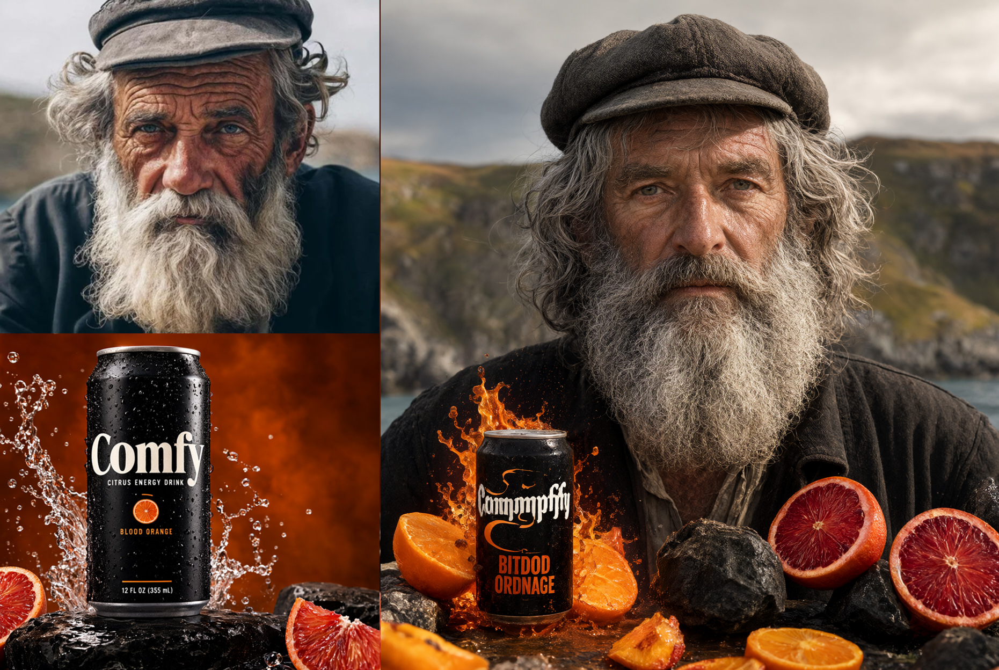
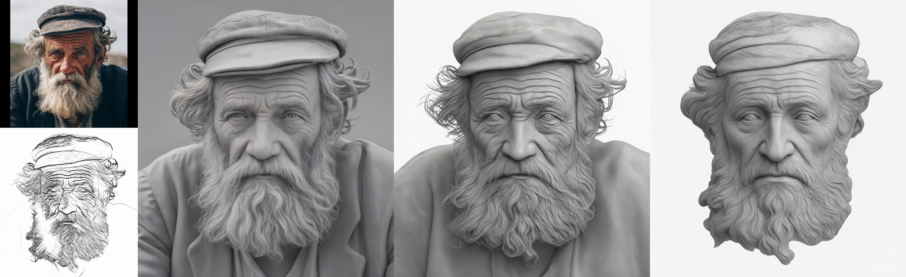

# ComfyUI-Qwen 2.1 Options

Extra controls for how strongly reference images condition Qwen Image 2.1 edits.
The model sees each reference through two channels: VAE latents spliced into the
DiT token sequence (pixel-level structure) and the text encoder's understanding
of the image (semantics). Both at full strength tends to overfixate on the
reference; these nodes let you weaken or drop either channel.

## Nodes

### Qwen Image 2.1 Edit Options (QQ)

Produces an options object for the encoder node. Inputs:

| Input | Description |
|---|---|
| `mode` | `latent + llm` (default) or `llm only` (drops the reference latents; the image conditions purely through the text encoder) |
| `apply_to_images` | Per-image share of `latent_noise` as `index(multiplier)`, e.g. `1(1.00),2(0.50)`. A single entry applies to every image; with several, unlisted images get no noise |
| `latent_noise` | Blends the reference latents toward noise (variance preserving, seeded): 0 keeps the reference intact, higher values destroy fine detail while keeping layout |
| `noise_seed` | Seed for the latent noise |
| `latent_resolution` | Resizes the reference latents independently of the text encoder's view; lower = fewer latent tokens, a coarser structural anchor. 0 uses the encoder node's resolution |
| `options` | Chain another Edit Options node; later nodes override the values they set |

### Text Encode Qwen Image 2.1 Options (QQ)

Drop-in variant of the core `Text Encode Qwen Image 2.1` with an extra optional
`options` input. Same inputs and outputs (positive / negative / latent);
disconnected it behaves exactly like the core node.

## Examples

Workflows are in [workflows](workflows):

| Workflow | Result |
|---|---|
| [llm only](workflows/qwen_image_2_1_image_edit_llm_only.json) |  |
| [latent + llm, lineart hold 20%](workflows/qwen_image_2_1_image_edit_latent+llm_lineart_hold_20.json) |  |
